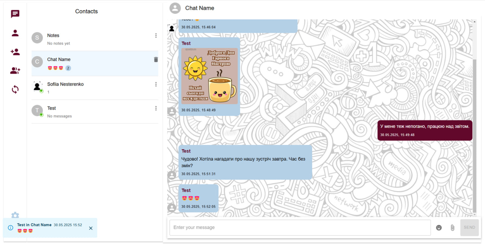

## PixChat

Secure real-time chat platform combining end-to-end encryption with image-based steganography. Messages are encrypted, embedded into images and delivered over SignalR.

### Features

**Steganographic messaging**: Hides encrypted messages inside PNG images using LSB (least significant bit) techniques.

**End-to-end encryption**: Uses AES for message content and RSA for key exchange between participants.

**Real-time chat**: Built on SignalR for low-latency messaging.

**One-on-one and group chats**: Support for direct conversations and multi-user rooms.

**One-time (self-destructing) messages**: Messages that are deleted after the first read.

**File & image sharing**: Sends media along with embedded steganographic content.

<p align="center">
  
</p>

### Prerequisites

- .NET 8 SDK
- Node.js
- PostgreSQL
- Email provider: MailJet (or compatible) credentials for sending 2FA codes and emails

### Configuration

Update the following sections in `PixChat.API/appsettings.json`:

- `ImageConfig.ImageFolderPath`: Absolute path to the folder containing PNG images used as steganography carriers.
- `ConnectionString`: PostgreSQL connection string (server, port, database, user, password).
- **JWT authentication**
  - `Jwt:Key`: Symmetric secret used to sign tokens.
  - `Jwt:Issuer`: Token issuer.
  - `Jwt:Audience`: Expected audience of tokens.
- **Email / 2FA**
  - `MailJet:ApiKey` and `MailJet:ApiSecret`: API credentials for the email provider.
  - `MailJet:FromEmail` and `MailJet:FromName`: Defaults for outgoing messages.

### Run the API

From the repository root:

```bash
cd PixChat.API
```

- **Apply database migrations**

```bash
dotnet ef database update
```

- **Run the API**

```bash
dotnet run
```

### Running the Frontend (UI)

From the repository root:

```bash
cd PixChat.UI
npm install
npm start
```

This starts the React dev server, typically at `http://localhost:3000`.
